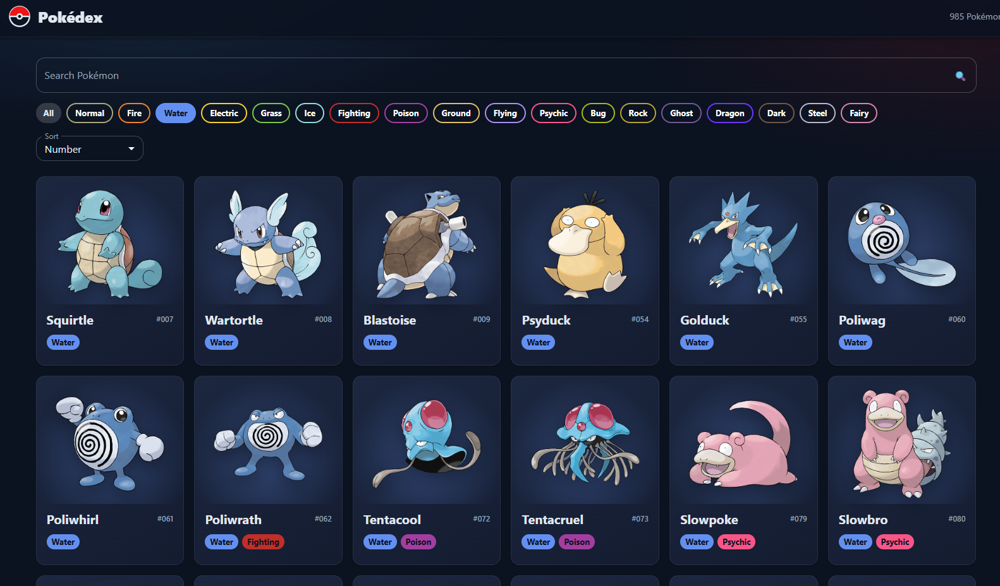

# poke-api

Pokémon Gallery View: explore, search and filter all Pokémon with the PokéAPI.



## Features

- Modern dark theme with type-colored badges and filters
- Search by name and filter by Pokémon type
- Sort by number, A → Z or Z → A
- Detail modal with stats, abilities, height and weight
- Paginated gallery with official artwork

## Tech stack

- React (Create React App)
- Material UI (MUI)
- Axios
- PokéAPI

## Getting started

```bash
npm install
npm start
```

## License

MIT